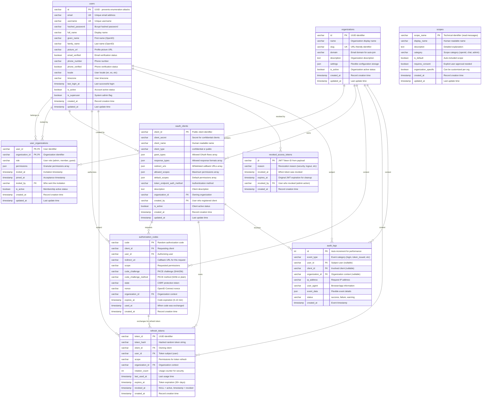
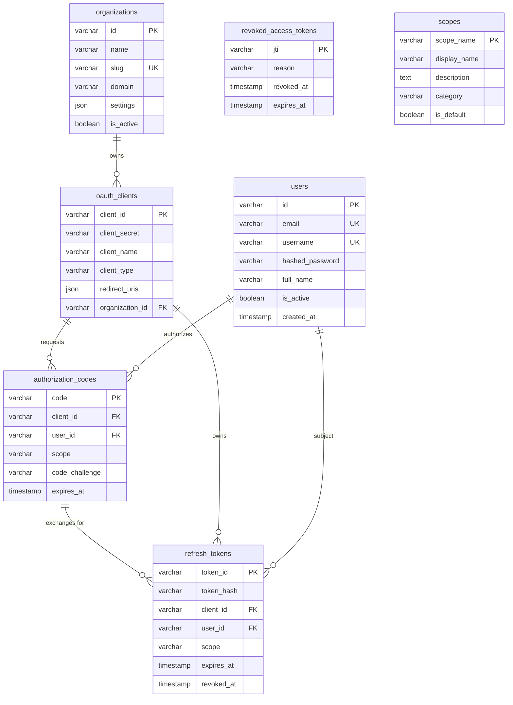
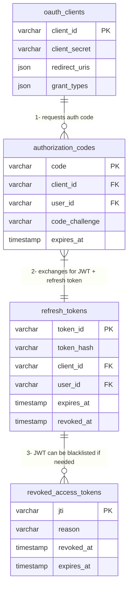

# OAuth 2.0 Database Schema - Hybrid Approach

## Architecture Overview

- **IDs**: UUIDs for business entities, integers for logs
- **Access Tokens**: JWT format (stateless, no database storage)
- **Refresh Tokens**: Database storage (for revocation and security)
- **Scopes**: Global definitions (not linked to specific entities)

## Complete OAuth 2.0 Database Schema



## Simplified Hybrid Token Approach

For the recommended hybrid approach (JWT access tokens + database refresh tokens):



## Hybrid Token Flow Diagram

Shows the recommended JWT + Database hybrid approach:



## Key Architecture Changes

### **Access Tokens (JWT Format)**

**Not stored in database** - Self-contained JSON Web Tokens:

```json
{
  "sub": "user-uuid-123",
  "client_id": "chatapp_web",
  "scope": "read:messages write:messages",
  "org_id": "org-uuid-456",
  "exp": 1642680000,
  "iat": 1642676400,
  "jti": "unique-token-id-123"
}
```

### **Refresh Tokens (Database Storage)**

- **Format**: Random string (256 bits)
- **Storage**: Hashed in database with bcrypt
- **Lifetime**: 30+ days
- **Revocation**: `revoked_at` timestamp (NULL = active)
- **No is_active field**: Single source of truth via `revoked_at`

### **UUID Strategy**

- **Business Entities**: users, organizations, oauth_clients use UUIDs
- **Security Benefit**: Prevents enumeration attacks
- **Audit Logs**: Use auto-increment integers for performance

### **Scopes as Global Definitions**

- **Not linked**: Scopes are reference definitions, not assigned
- **Connection**: Happens through client allowed_scopes, auth codes, and tokens
- **Flexibility**: Clients can request any valid combination
- **Future**: Can add organization_scopes table later if needed

### **Optional Revocation Table**

- **Only for critical security scenarios**: Store JWT IDs that need immediate invalidation
- **Cleanup job needed**: Remove expired JWTs from blacklist
- **Most tokens**: Expire naturally (15-60 minutes)

## Benefits of This Hybrid Approach

- ✅ **Fast API calls** - No database lookup for access token validation
- ✅ **Secure refresh** - Can revoke long-lived tokens instantly
- ✅ **Scalable** - Stateless JWTs reduce database load
- ✅ **Flexible** - Can add revocation blacklist if needed
- ✅ **Simple start** - Begin with pure JWTs, add complexity later
- ✅ **Security focused** - UUIDs prevent user enumeration
- ✅ **Performance optimized** - Auto-increment IDs for high-volume audit logs
